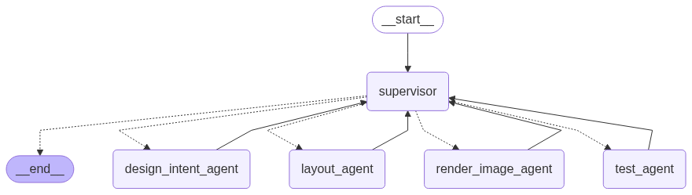

# 🧠 LangGraph Maze Generator 🕹️  
*A Text-to-Level Generation System for 2D Tile-Based Games using Multi-Agent AI*



---

## 📌 Overview

**LangGraph Maze Generator** is a multi-agent AI system that allows users to generate 2D mazes for games using natural language descriptions. It combines LangGraph's coordination power with Python-based rendering tools to create fully playable levels.

---

## 🎯 Project Goals

- Convert natural language prompts into structured maze levels.
- Use agent collaboration to design, test, and render maps.
- Offer a playable visual representation using Python tools.
- Provide a user-friendly Gradio interface.

---

## 🧠 Multi-Agent Architecture

```
┌────────────┐
│  __start__ │
└────┬───────┘
     ▼
 ┌───────────┐
 │ Supervisor│
 └────┬──────┘
      ├────────────> Design Intent Agent
      ├────────────> Layout Agent
      ├────────────> Test Agent
      └────────────> Render Image Agent
           ↓
        __end__
```

### Agent Responsibilities

| Agent Name             | Role Description |
|------------------------|------------------|
| **Supervisor**         | Controls execution and routing between agents. |
| **Design Intent Agent**| Extracts key level info like theme, enemies, traps, and size from text. |
| **Layout Agent**       | Builds a 2D NumPy grid maze layout. |
| **Test Agent**         | Validates level solvability using BFS. |
| **Render Image Agent** | Converts the grid into an image using `matplotlib`. |

---

## 🚀 Getting Started

### 1️⃣ Clone the Repository

```bash
git clone https://github.com/your-username/langgraph-maze-generator.git
cd langgraph-maze-generator
```

### 2️⃣ Install Requirements

```bash
pip install -r requirements.txt
```

### 3️⃣ Launch the App

```bash
python app.py
```

Once running, the Gradio app will open in your browser for interaction.

---

## 🧩 Sample Prompts

```text
- "Create a dungeon with 2 enemies and 1 goal"
- "Design a maze with traps and hidden exits"
- "A 10x10 horror level with 3 enemies and 2 traps"
```

---

## 📸 Sample Outputs

| Prompt | Rendered Maze |
|--------|---------------|
| "spooky maze with 1 enemy and 2 traps" |  |
| "dungeon with a single path to the goal" |  |

---

## 🛠 Tech Stack

- ⚙️ `LangGraph` for multi-agent coordination
- 🧮 `NumPy` for maze representation
- 🧭 `NetworkX` for BFS/pathfinding
- 🖼️ `Matplotlib` for image rendering
- 🌐 `Gradio` for interactive UI
- 🐍 Python 3.10+

---

## 📁 Project Structure

```
.
├── app.py                         # Gradio interface
├── agents/
│   ├── design_intent_agent.py    # Extracts maze intent
│   ├── layout_agent.py           # Builds 2D grid
│   ├── test_agent.py             # Path validation
│   └── render_image_agent.py     # Renders image
├── generated_mazes/              # Saved maze images
├── static/                       # Temporary file access
├── architecture.png              # Architecture diagram
├── requirements.txt              # Python dependencies
└── README.md                     # This file
```

---

## 🔧 Features

- ✅ Multi-agent level generation
- ✅ Text-to-tile layout translation
- ✅ BFS-based path validation
- ✅ Visual maze export and gallery
- ✅ Hugging Face Spaces compatible

---

## 📦 Deployment

To deploy on Hugging Face Spaces:

1. Create a new [Space](https://huggingface.co/spaces).
2. Select “Gradio” as the SDK.
3. Upload your code and assets.
4. Make sure you have a `static/` folder for images and proper `app.py`.

---

## 🧪 Tests

- Maze connectivity (BFS)
- Agent coordination trace
- Prompt-to-level consistency
- Image rendering verification

---

## 🚧 Future Enhancements

- 🎨 Custom tilesets (grass, lava, etc.)
- 🧭 Player movement demo
- 📤 Export maze as Tiled `.tmx` format
- 🧠 Add LLM-based enemy placement logic
- 🌍 Multiplayer prompt interface

---

## 📝 License

This project is licensed under the MIT License. See the [LICENSE](LICENSE) file for more details.

---

## 🙏 Acknowledgements

- [LangGraph](https://github.com/langchain-ai/langgraph)
- [Gradio](https://gradio.app/)
- [Matplotlib](https://matplotlib.org/)
- [Hugging Face Spaces](https://huggingface.co/spaces)
- [NetworkX](https://networkx.org/)
